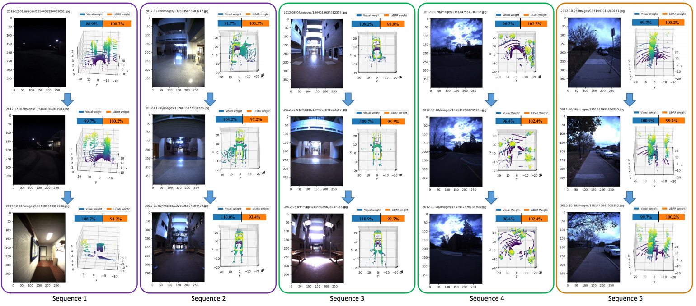

# AdaFusion: Visual-LiDAR Fusion with Adaptive Weights for Place Recognition
## Description
This is the source code for paper

> H. Lai, P. Yin, S. Scherer. AdaFusion: Visual-LiDAR Fusion with Adaptive Weights for Place Recognition. IEEE Robotics and Automation Letters.

AdaFusion is a multi-modality fusion network that learns the compact feature representation of both images and point clouds and then adjusts their contribution in different environmental situation. The weights serve as dynamic adjustment to the contribution of the two modalities in different environments.



## Usage
- For training:
```bash
python train.py --work-path experiments/xxxx [--resume]
```
